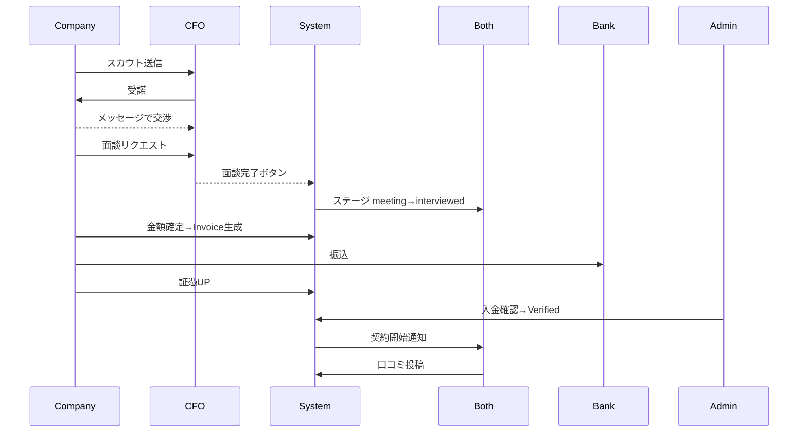
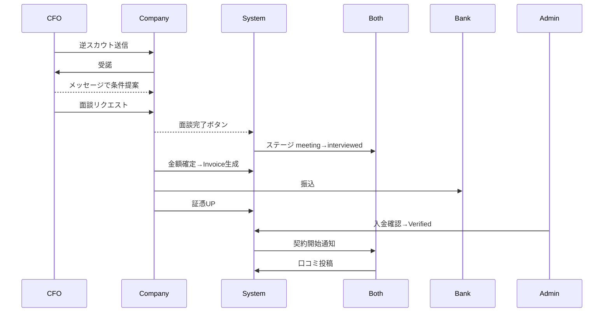

# **RIGHTARM β版 完全版SQL（Version 1.2）- Supabase対応**

以下は、論理削除・CASCADE制約修正・会話ユニーク制約の対称性・イベントログパーティション化を完全実装したSupabase用SQLです。

---

## **Step 1: ENUMタイプの作成**

```sql
-- ENUMタイプを作成
CREATE TYPE profile_type_enum                AS ENUM ('company','cfo');
CREATE TYPE tag_type_enum                    AS ENUM ('skill','challenge');
CREATE TYPE rightarm_application_type_enum   AS ENUM ('application','scout_company','scout_cfo');
CREATE TYPE rightarm_application_status_enum AS ENUM ('pending','accepted','interviewed','rejected','withdrawn');
CREATE TYPE rightarm_conversation_stage_enum AS ENUM ('inquiry','shortlist','negotiation','meeting','contracted');
CREATE TYPE rightarm_meeting_status_enum     AS ENUM ('scheduled','completed','cancelled');
CREATE TYPE rightarm_invoice_status_enum     AS ENUM ('pending','paid','verified');
CREATE TYPE rightarm_contract_status_enum    AS ENUM ('pending','active','completed','cancelled');
CREATE TYPE rightarm_message_type_enum       AS ENUM ('text','file','image','meeting_invite');
```

---

## **Step 2: 基本テーブルの作成**

```sql
-- ユーザーテーブル
CREATE TABLE rightarm_users (
  id UUID PRIMARY KEY DEFAULT gen_random_uuid(),
  email             VARCHAR(255) UNIQUE NOT NULL,
  password_hash     VARCHAR(255)        NOT NULL,
  user_type         profile_type_enum   NOT NULL,
  email_verified    BOOLEAN DEFAULT FALSE,
  status            VARCHAR(20) DEFAULT 'active',
  deleted_at        TIMESTAMPTZ,
  created_at        TIMESTAMPTZ DEFAULT now(),
  updated_at        TIMESTAMPTZ DEFAULT now()
);

-- 企業プロフィール
CREATE TABLE rightarm_company_profiles (
  id UUID PRIMARY KEY DEFAULT gen_random_uuid(),
  user_id             UUID NOT NULL,
  company_name        VARCHAR(255) NOT NULL,
  company_description TEXT,
  industry            VARCHAR(100),
  company_size        VARCHAR(30),
  revenue_range       VARCHAR(30),
  location_prefecture VARCHAR(50),
  location_city       VARCHAR(100),
  website_url         VARCHAR(255),
  established_year    INTEGER,
  deleted_at          TIMESTAMPTZ,
  created_at          TIMESTAMPTZ DEFAULT now(),
  updated_at          TIMESTAMPTZ DEFAULT now(),
  
  CONSTRAINT fk_company_user 
    FOREIGN KEY (user_id) REFERENCES rightarm_users(id) ON DELETE RESTRICT
);

-- CFOプロフィール
CREATE TABLE rightarm_cfo_profiles (
  id UUID PRIMARY KEY DEFAULT gen_random_uuid(),
  user_id             UUID NOT NULL,
  first_name          VARCHAR(100) NOT NULL,
  last_name           VARCHAR(100) NOT NULL,
  display_name        VARCHAR(100),
  bio                 TEXT,
  location_prefecture VARCHAR(50),
  location_city       VARCHAR(100),
  years_experience    INTEGER,
  hourly_rate_min     INTEGER,
  hourly_rate_max     INTEGER,
  rating_average      NUMERIC(3,2) DEFAULT 0.00,
  rating_count        INTEGER DEFAULT 0,
  deleted_at          TIMESTAMPTZ,
  created_at          TIMESTAMPTZ DEFAULT now(),
  updated_at          TIMESTAMPTZ DEFAULT now(),
  
  CONSTRAINT fk_cfo_user 
    FOREIGN KEY (user_id) REFERENCES rightarm_users(id) ON DELETE RESTRICT
);

-- タグマスタ
CREATE TABLE rightarm_tags (
  id UUID PRIMARY KEY DEFAULT gen_random_uuid(),
  name      VARCHAR(80) UNIQUE NOT NULL,
  type      tag_type_enum      NOT NULL,
  is_active BOOLEAN DEFAULT TRUE,
  created_at TIMESTAMPTZ DEFAULT now()
);

-- プロフィール・タグ紐付け
CREATE TABLE rightarm_profile_tags (
  profile_id   UUID NOT NULL,
  profile_type profile_type_enum NOT NULL,
  tag_id       UUID NOT NULL,
  
  PRIMARY KEY(profile_id, tag_id, profile_type),
  CONSTRAINT fk_profile_tag 
    FOREIGN KEY (tag_id) REFERENCES rightarm_tags(id) ON DELETE RESTRICT
);
```

---

## **Step 3: アプリケーション・スカウト関連テーブル**

```sql
-- アプリケーション・スカウト
CREATE TABLE rightarm_applications (
  id UUID PRIMARY KEY DEFAULT gen_random_uuid(),
  project_id       UUID,
  company_id       UUID NOT NULL,
  cfo_id           UUID NOT NULL,
  application_type rightarm_application_type_enum NOT NULL,
  status           rightarm_application_status_enum DEFAULT 'pending',
  cover_message    TEXT,
  deleted_at       TIMESTAMPTZ,
  created_at       TIMESTAMPTZ DEFAULT now(),
  updated_at       TIMESTAMPTZ DEFAULT now(),
  
  CONSTRAINT fk_app_company 
    FOREIGN KEY (company_id) REFERENCES rightarm_company_profiles(id) ON DELETE RESTRICT,
  CONSTRAINT fk_app_cfo 
    FOREIGN KEY (cfo_id) REFERENCES rightarm_cfo_profiles(id) ON DELETE RESTRICT
);

-- 会話
CREATE TABLE rightarm_conversations (
  id UUID PRIMARY KEY DEFAULT gen_random_uuid(),
  participant_1_id UUID NOT NULL,
  participant_2_id UUID NOT NULL,
  stage            rightarm_conversation_stage_enum DEFAULT 'inquiry',
  last_message_at  TIMESTAMPTZ,
  deleted_at       TIMESTAMPTZ,
  created_at       TIMESTAMPTZ DEFAULT now(),
  
  CONSTRAINT fk_conv_participant1 
    FOREIGN KEY (participant_1_id) REFERENCES rightarm_users(id) ON DELETE RESTRICT,
  CONSTRAINT fk_conv_participant2 
    FOREIGN KEY (participant_2_id) REFERENCES rightarm_users(id) ON DELETE RESTRICT,
  CONSTRAINT chk_different_participants 
    CHECK (participant_1_id <> participant_2_id)
);

-- メッセージ
CREATE TABLE rightarm_messages (
  id UUID PRIMARY KEY DEFAULT gen_random_uuid(),
  conversation_id UUID NOT NULL,
  sender_id       UUID NOT NULL,
  content         TEXT,
  message_type    rightarm_message_type_enum DEFAULT 'text',
  read_at         TIMESTAMPTZ,
  deleted_at      TIMESTAMPTZ,
  created_at      TIMESTAMPTZ DEFAULT now(),
  
  CONSTRAINT fk_msg_conversation 
    FOREIGN KEY (conversation_id) REFERENCES rightarm_conversations(id) ON DELETE RESTRICT,
  CONSTRAINT fk_msg_sender 
    FOREIGN KEY (sender_id) REFERENCES rightarm_users(id) ON DELETE RESTRICT
);
```

---

## **Step 4: 面談・契約・請求テーブル**

```sql
-- 面談
CREATE TABLE rightarm_meetings (
  id UUID PRIMARY KEY DEFAULT gen_random_uuid(),
  organizer_id     UUID NOT NULL,
  participant_id   UUID NOT NULL,
  scheduled_at     TIMESTAMPTZ NOT NULL,
  duration_minutes INTEGER DEFAULT 60,
  meeting_url      VARCHAR(255),
  status           rightarm_meeting_status_enum DEFAULT 'scheduled',
  deleted_at       TIMESTAMPTZ,
  created_at       TIMESTAMPTZ DEFAULT now(),
  
  CONSTRAINT fk_meeting_organizer 
    FOREIGN KEY (organizer_id) REFERENCES rightarm_users(id) ON DELETE RESTRICT,
  CONSTRAINT fk_meeting_participant 
    FOREIGN KEY (participant_id) REFERENCES rightarm_users(id) ON DELETE RESTRICT
);

-- 契約
CREATE TABLE rightarm_contracts (
  id UUID PRIMARY KEY DEFAULT gen_random_uuid(),
  application_id UUID NOT NULL,
  company_id     UUID NOT NULL,
  cfo_id         UUID NOT NULL,
  amount         INTEGER NOT NULL,
  fee_percentage NUMERIC(5,2) DEFAULT 5.00,
  fee_amount     INTEGER GENERATED ALWAYS AS (CAST(amount * fee_percentage / 100 AS INTEGER)) STORED,
  status         rightarm_contract_status_enum DEFAULT 'pending',
  started_at     TIMESTAMPTZ,
  ended_at       TIMESTAMPTZ,
  deleted_at     TIMESTAMPTZ,
  created_at     TIMESTAMPTZ DEFAULT now(),
  
  CONSTRAINT fk_contract_application 
    FOREIGN KEY (application_id) REFERENCES rightarm_applications(id) ON DELETE RESTRICT,
  CONSTRAINT fk_contract_company 
    FOREIGN KEY (company_id) REFERENCES rightarm_company_profiles(id) ON DELETE RESTRICT,
  CONSTRAINT fk_contract_cfo 
    FOREIGN KEY (cfo_id) REFERENCES rightarm_cfo_profiles(id) ON DELETE RESTRICT
);

-- 請求書
CREATE TABLE rightarm_invoices (
  id UUID PRIMARY KEY DEFAULT gen_random_uuid(),
  contract_id    UUID NOT NULL,
  company_id     UUID,
  cfo_id         UUID,
  amount         INTEGER NOT NULL,
  fee_percentage NUMERIC(5,2) DEFAULT 5.00,
  fee_amount     INTEGER GENERATED ALWAYS AS (CAST(amount * fee_percentage / 100 AS INTEGER)) STORED,
  total_amount   INTEGER GENERATED ALWAYS AS (amount + CAST(amount * fee_percentage / 100 AS INTEGER)) STORED,
  evidence_url   VARCHAR(255),
  status         rightarm_invoice_status_enum DEFAULT 'pending',
  paid_at        TIMESTAMPTZ,
  verified_at    TIMESTAMPTZ,
  deleted_at     TIMESTAMPTZ,
  created_at     TIMESTAMPTZ DEFAULT now(),
  
  CONSTRAINT fk_invoice_contract 
    FOREIGN KEY (contract_id) REFERENCES rightarm_contracts(id) ON DELETE RESTRICT
);

-- 口コミ・レビュー
CREATE TABLE rightarm_reviews (
  id UUID PRIMARY KEY DEFAULT gen_random_uuid(),
  contract_id UUID NOT NULL,
  reviewer_id UUID NOT NULL,
  reviewee_id UUID NOT NULL,
  rating      INTEGER NOT NULL,
  title       VARCHAR(255),
  content     TEXT,
  deleted_at  TIMESTAMPTZ,
  created_at  TIMESTAMPTZ DEFAULT now(),
  
  CONSTRAINT fk_review_contract 
    FOREIGN KEY (contract_id) REFERENCES rightarm_contracts(id) ON DELETE RESTRICT,
  CONSTRAINT fk_review_reviewer 
    FOREIGN KEY (reviewer_id) REFERENCES rightarm_users(id) ON DELETE RESTRICT,
  CONSTRAINT fk_review_reviewee 
    FOREIGN KEY (reviewee_id) REFERENCES rightarm_users(id) ON DELETE RESTRICT,
  CONSTRAINT chk_rating_range 
    CHECK (rating BETWEEN 1 AND 5)
);
```

---

## **Step 5: イベントログ（パーティション対応）**

```sql
-- イベントログ（パーティション親テーブル）
CREATE TABLE rightarm_event_log (
  id UUID DEFAULT gen_random_uuid(),
  user_id     UUID,
  partner_id  UUID,
  entity_type VARCHAR(40),
  entity_id   UUID,
  event_type  VARCHAR(40),
  deleted_at  TIMESTAMPTZ,
  created_at  TIMESTAMPTZ DEFAULT now(),
  
  CONSTRAINT fk_event_user 
    FOREIGN KEY (user_id) REFERENCES rightarm_users(id) ON DELETE RESTRICT
) PARTITION BY RANGE (created_at);

-- 現在月のパーティション作成
CREATE TABLE rightarm_event_log_y2025m06 PARTITION OF rightarm_event_log
  FOR VALUES FROM ('2025-06-01') TO ('2025-07-01');

-- 翌月のパーティション作成
CREATE TABLE rightarm_event_log_y2025m07 PARTITION OF rightarm_event_log
  FOR VALUES FROM ('2025-07-01') TO ('2025-08-01');
```

---

## **Step 6: インデックス作成**

```sql
-- 基本インデックス（論理削除考慮）
CREATE INDEX idx_rightarm_users_email ON rightarm_users(email) WHERE deleted_at IS NULL;
CREATE INDEX idx_company_user ON rightarm_company_profiles(user_id) WHERE deleted_at IS NULL;
CREATE INDEX idx_cfo_user ON rightarm_cfo_profiles(user_id) WHERE deleted_at IS NULL;

-- アプリケーション関連
CREATE INDEX idx_app_company_active ON rightarm_applications(company_id) WHERE deleted_at IS NULL;
CREATE INDEX idx_app_cfo_active ON rightarm_applications(cfo_id) WHERE deleted_at IS NULL;
CREATE INDEX idx_app_status_active ON rightarm_applications(status) WHERE deleted_at IS NULL;
CREATE INDEX idx_app_type_active ON rightarm_applications(application_type) WHERE deleted_at IS NULL;

-- 会話・メッセージ関連
CREATE INDEX idx_msg_conv ON rightarm_messages(conversation_id) WHERE deleted_at IS NULL;
CREATE INDEX idx_msg_unread ON rightarm_messages(conversation_id, read_at) 
  WHERE deleted_at IS NULL AND read_at IS NULL;

-- 契約・請求関連
CREATE INDEX idx_contract_status_active ON rightarm_contracts(status) WHERE deleted_at IS NULL;
CREATE INDEX idx_invoice_status_active ON rightarm_invoices(status) WHERE deleted_at IS NULL;
CREATE INDEX idx_meeting_schedule_active ON rightarm_meetings(scheduled_at) WHERE deleted_at IS NULL;

-- レビュー関連
CREATE INDEX idx_reviews_reviewee_active ON rightarm_reviews(reviewee_id) WHERE deleted_at IS NULL;

-- タグ関連
CREATE INDEX idx_profile_tags_tag ON rightarm_profile_tags(tag_id);
CREATE INDEX idx_profile_tags_profile ON rightarm_profile_tags(profile_id, profile_type);

-- 会話のユニーク制約（対称性考慮）
CREATE UNIQUE INDEX uniq_conv_pair_sorted 
  ON rightarm_conversations(
    LEAST(participant_1_id, participant_2_id),
    GREATEST(participant_1_id, participant_2_id)
  ) WHERE deleted_at IS NULL;

-- 全文検索用GINインデックス
CREATE INDEX idx_cfo_search ON rightarm_cfo_profiles
  USING gin(to_tsvector('japanese', 
    COALESCE(first_name, '') || ' ' || 
    COALESCE(last_name, '') || ' ' || 
    COALESCE(bio, '')
  )) WHERE deleted_at IS NULL;

CREATE INDEX idx_company_search ON rightarm_company_profiles
  USING gin(to_tsvector('japanese', 
    COALESCE(company_name, '') || ' ' || 
    COALESCE(company_description, '')
  )) WHERE deleted_at IS NULL;
```

---

## **Step 7: トリガ関数とトリガ**

```sql
-- スカウト送信ログ用トリガ関数
CREATE OR REPLACE FUNCTION fn_log_scout_sent()
RETURNS trigger AS $$
BEGIN
  IF NEW.application_type IN ('scout_company','scout_cfo') THEN
    INSERT INTO rightarm_event_log
      (user_id, partner_id, entity_type, entity_id, event_type)
    VALUES
      (CASE WHEN NEW.application_type='scout_company'
            THEN (SELECT user_id FROM rightarm_company_profiles WHERE id = NEW.company_id)
            ELSE (SELECT user_id FROM rightarm_cfo_profiles WHERE id = NEW.cfo_id) END,
       CASE WHEN NEW.application_type='scout_company'
            THEN (SELECT user_id FROM rightarm_cfo_profiles WHERE id = NEW.cfo_id)
            ELSE (SELECT user_id FROM rightarm_company_profiles WHERE id = NEW.company_id) END,
       'application',
       NEW.id,
       'scout_sent');
  END IF;
  RETURN NEW;
END; 
$$ LANGUAGE plpgsql;

-- 論理削除カスケード用トリガ関数
CREATE OR REPLACE FUNCTION fn_soft_delete_cascade()
RETURNS trigger AS $$
BEGIN
  IF OLD.deleted_at IS NULL AND NEW.deleted_at IS NOT NULL THEN
    
    -- 契約削除時：関連する請求書とレビューを論理削除
    IF TG_TABLE_NAME = 'rightarm_contracts' THEN
      UPDATE rightarm_invoices
        SET deleted_at = NEW.deleted_at
        WHERE contract_id = NEW.id AND deleted_at IS NULL;
        
      UPDATE rightarm_reviews
        SET deleted_at = NEW.deleted_at
        WHERE contract_id = NEW.id AND deleted_at IS NULL;
    END IF;
    
    -- アプリケーション削除時：関連する契約を論理削除
    IF TG_TABLE_NAME = 'rightarm_applications' THEN
      UPDATE rightarm_contracts
        SET deleted_at = NEW.deleted_at
        WHERE application_id = NEW.id AND deleted_at IS NULL;
    END IF;
    
    -- 会話削除時：関連するメッセージを論理削除
    IF TG_TABLE_NAME = 'rightarm_conversations' THEN
      UPDATE rightarm_messages
        SET deleted_at = NEW.deleted_at
        WHERE conversation_id = NEW.id AND deleted_at IS NULL;
    END IF;
    
    -- ユーザー削除時：関連するプロフィールとイベントログを論理削除
    IF TG_TABLE_NAME = 'rightarm_users' THEN
      UPDATE rightarm_company_profiles
        SET deleted_at = NEW.deleted_at
        WHERE user_id = NEW.id AND deleted_at IS NULL;
        
      UPDATE rightarm_cfo_profiles
        SET deleted_at = NEW.deleted_at
        WHERE user_id = NEW.id AND deleted_at IS NULL;
        
      UPDATE rightarm_event_log
        SET deleted_at = NEW.deleted_at
        WHERE user_id = NEW.id AND deleted_at IS NULL;
    END IF;
    
  END IF;
  RETURN NEW;
END;
$$ LANGUAGE plpgsql;

-- CFO評価更新用トリガ関数
CREATE OR REPLACE FUNCTION fn_update_cfo_rating()
RETURNS trigger AS $$
DECLARE
  target_cfo_id UUID;
  current_avg NUMERIC(3,2);
  current_count INTEGER;
BEGIN
  -- 契約からCFO IDを取得
  SELECT cfo_id INTO target_cfo_id 
  FROM rightarm_contracts 
  WHERE id = NEW.contract_id AND deleted_at IS NULL;
  
  -- 現在の評価情報を取得
  SELECT rating_average, rating_count 
  INTO current_avg, current_count
  FROM rightarm_cfo_profiles 
  WHERE id = target_cfo_id AND deleted_at IS NULL;
  
  -- 新しい平均評価を計算して更新
  UPDATE rightarm_cfo_profiles
  SET 
    rating_count = current_count + 1,
    rating_average = ROUND(
      ((current_avg * current_count) + NEW.rating) / (current_count + 1), 2
    )
  WHERE id = target_cfo_id AND deleted_at IS NULL;
  
  RETURN NEW;
END;
$$ LANGUAGE plpgsql;

-- トリガ作成
CREATE TRIGGER trg_log_scout_sent
  AFTER INSERT ON rightarm_applications
  FOR EACH ROW EXECUTE FUNCTION fn_log_scout_sent();

CREATE TRIGGER trg_soft_delete_contract
  AFTER UPDATE OF deleted_at ON rightarm_contracts
  FOR EACH ROW EXECUTE FUNCTION fn_soft_delete_cascade();

CREATE TRIGGER trg_soft_delete_application
  AFTER UPDATE OF deleted_at ON rightarm_applications
  FOR EACH ROW EXECUTE FUNCTION fn_soft_delete_cascade();

CREATE TRIGGER trg_soft_delete_conversation
  AFTER UPDATE OF deleted_at ON rightarm_conversations
  FOR EACH ROW EXECUTE FUNCTION fn_soft_delete_cascade();

CREATE TRIGGER trg_soft_delete_user
  AFTER UPDATE OF deleted_at ON rightarm_users
  FOR EACH ROW EXECUTE FUNCTION fn_soft_delete_cascade();

CREATE TRIGGER trg_update_cfo_rating
  AFTER INSERT ON rightarm_reviews
  FOR EACH ROW 
  WHEN (NEW.deleted_at IS NULL)
  EXECUTE FUNCTION fn_update_cfo_rating();
```

---

## **Step 8: 初期データ投入**

```sql
-- スキルタグ（31件）
INSERT INTO rightarm_tags(id, name, type) VALUES
(gen_random_uuid(), '資金調達', 'skill'),
(gen_random_uuid(), '銀行融資対応', 'skill'),
(gen_random_uuid(), '補助金・助成金申請', 'skill'),
(gen_random_uuid(), 'VC・エクイティ調達', 'skill'),
(gen_random_uuid(), '投資家対応(IR)', 'skill'),
(gen_random_uuid(), '資本政策設計', 'skill'),
(gen_random_uuid(), '財務デューデリ', 'skill'),
(gen_random_uuid(), '資金繰り表作成', 'skill'),
(gen_random_uuid(), 'キャッシュフロー改善', 'skill'),
(gen_random_uuid(), 'IPO準備支援', 'skill'),
(gen_random_uuid(), 'IPO内部統制', 'skill'),
(gen_random_uuid(), 'M&Aアドバイザリー(売手)', 'skill'),
(gen_random_uuid(), 'M&Aアドバイザリー(買手)', 'skill'),
(gen_random_uuid(), 'バリュエーション', 'skill'),
(gen_random_uuid(), 'PMI支援', 'skill'),
(gen_random_uuid(), '管理会計構築', 'skill'),
(gen_random_uuid(), '月次決算早期化', 'skill'),
(gen_random_uuid(), 'BIツール導入', 'skill'),
(gen_random_uuid(), '原価計算導入', 'skill'),
(gen_random_uuid(), 'クラウド会計導入', 'skill'),
(gen_random_uuid(), 'ERP導入', 'skill'),
(gen_random_uuid(), '財務DX推進', 'skill'),
(gen_random_uuid(), '再生計画立案', 'skill'),
(gen_random_uuid(), '資金繰り改善(リスケ)', 'skill'),
(gen_random_uuid(), '事業承継支援', 'skill'),
(gen_random_uuid(), '経理組織構築', 'skill'),
(gen_random_uuid(), '内部統制構築', 'skill'),
(gen_random_uuid(), '会計方針整備', 'skill'),
(gen_random_uuid(), '週1日対応可', 'skill'),
(gen_random_uuid(), 'フルリモート可', 'skill'),
(gen_random_uuid(), '成果報酬型対応可', 'skill');

-- 課題タグ（16件）
INSERT INTO rightarm_tags(id, name, type) VALUES
(gen_random_uuid(), 'IPO準備', 'challenge'),
(gen_random_uuid(), '資金調達', 'challenge'),
(gen_random_uuid(), '銀行折衝', 'challenge'),
(gen_random_uuid(), '補助金申請', 'challenge'),
(gen_random_uuid(), '管理会計導入', 'challenge'),
(gen_random_uuid(), '原価管理強化', 'challenge'),
(gen_random_uuid(), '資金繰り改善', 'challenge'),
(gen_random_uuid(), '財務DX', 'challenge'),
(gen_random_uuid(), 'ERP導入', 'challenge'),
(gen_random_uuid(), 'M&A売却', 'challenge'),
(gen_random_uuid(), 'M&A買収', 'challenge'),
(gen_random_uuid(), 'PMI推進', 'challenge'),
(gen_random_uuid(), '事業再生', 'challenge'),
(gen_random_uuid(), '事業承継', 'challenge'),
(gen_random_uuid(), '経営管理強化', 'challenge'),
(gen_random_uuid(), '内部統制構築', 'challenge');
```

---

## **Step 9: Row Level Security (RLS) 設定**

```sql
-- RLS有効化
ALTER TABLE rightarm_users ENABLE ROW LEVEL SECURITY;
ALTER TABLE rightarm_company_profiles ENABLE ROW LEVEL SECURITY;
ALTER TABLE rightarm_cfo_profiles ENABLE ROW LEVEL SECURITY;
ALTER TABLE rightarm_applications ENABLE ROW LEVEL SECURITY;
ALTER TABLE rightarm_conversations ENABLE ROW LEVEL SECURITY;
ALTER TABLE rightarm_messages ENABLE ROW LEVEL SECURITY;
ALTER TABLE rightarm_contracts ENABLE ROW LEVEL SECURITY;
ALTER TABLE rightarm_invoices ENABLE ROW LEVEL SECURITY;
ALTER TABLE rightarm_reviews ENABLE ROW LEVEL SECURITY;

-- 基本的なRLSポリシー
CREATE POLICY "Users can view own data" ON rightarm_users
  FOR SELECT USING (id = auth.uid() AND deleted_at IS NULL);

CREATE POLICY "Company profiles visible to owner" ON rightarm_company_profiles
  FOR ALL USING (user_id = auth.uid() AND deleted_at IS NULL);

CREATE POLICY "CFO profiles visible to owner" ON rightarm_cfo_profiles
  FOR ALL USING (user_id = auth.uid() AND deleted_at IS NULL);

-- アプリケーション（双方向アクセス）
CREATE POLICY "Applications visible to participants" ON rightarm_applications
  FOR SELECT USING (
    deleted_at IS NULL AND (
      company_id IN (
        SELECT id FROM rightarm_company_profiles 
        WHERE user_id = auth.uid() AND deleted_at IS NULL
      )
      OR cfo_id IN (
        SELECT id FROM rightarm_cfo_profiles 
        WHERE user_id = auth.uid() AND deleted_at IS NULL
      )
    )
  );

-- 会話とメッセージ
CREATE POLICY "Conversations visible to participants" ON rightarm_conversations
  FOR SELECT USING (
    deleted_at IS NULL AND 
    (participant_1_id = auth.uid() OR participant_2_id = auth.uid())
  );

CREATE POLICY "Messages visible to conversation participants" ON rightarm_messages
  FOR SELECT USING (
    deleted_at IS NULL AND
    EXISTS (
      SELECT 1 FROM rightarm_conversations 
      WHERE id = conversation_id 
      AND deleted_at IS NULL
      AND (participant_1_id = auth.uid() OR participant_2_id = auth.uid())
    )
  );

-- 管理者用ポリシー（必要に応じて追加）
-- CREATE POLICY "Admin full access" ON rightarm_users
--   FOR ALL USING (
--     EXISTS (
--       SELECT 1 FROM rightarm_users 
--       WHERE id = auth.uid() AND status = 'admin'
--     )
--   );
```

---

## **Step 10: 便利なビューの作成**

```sql
-- アクティブなプロフィール一覧ビュー
CREATE VIEW v_active_cfo_profiles AS
SELECT cp.*, u.email, u.email_verified
FROM rightarm_cfo_profiles cp
JOIN rightarm_users u ON cp.user_id = u.id
WHERE cp.deleted_at IS NULL AND u.deleted_at IS NULL;

CREATE VIEW v_active_company_profiles AS
SELECT cp.*, u.email, u.email_verified
FROM rightarm_company_profiles cp
JOIN rightarm_users u ON cp.user_id = u.id
WHERE cp.deleted_at IS NULL AND u.deleted_at IS NULL;


# **RIGHTARM β版 完全版SQL（Version 1.2）継続 - Supabase対応**

---

## **Step 10: 便利なビューの作成（完成版）**

```sql
-- KPI用ビュー（スカウトファネル分析）
CREATE VIEW v_scout_funnel AS
SELECT
  DATE_TRUNC('month', created_at) as month,
  application_type,
  COUNT(*) FILTER (WHERE status = 'pending') as sent,
  COUNT(*) FILTER (WHERE status = 'accepted') as accepted,
  COUNT(*) FILTER (WHERE status = 'interviewed') as interviewed,
  ROUND(
    100.0 * COUNT(*) FILTER (WHERE status = 'interviewed')
    / NULLIF(COUNT(*) FILTER (WHERE status = 'pending'), 0), 1
  ) AS interview_rate_pct
FROM rightarm_applications
WHERE deleted_at IS NULL
  AND application_type IN ('scout_company', 'scout_cfo')
GROUP BY DATE_TRUNC('month', created_at), application_type
ORDER BY month DESC, application_type;

-- 未読メッセージ数ビュー
CREATE VIEW v_unread_message_counts AS
SELECT 
  c.id as conversation_id,
  c.participant_1_id,
  c.participant_2_id,
  COUNT(m.id) FILTER (WHERE m.read_at IS NULL AND m.sender_id != c.participant_1_id) as unread_for_p1,
  COUNT(m.id) FILTER (WHERE m.read_at IS NULL AND m.sender_id != c.participant_2_id) as unread_for_p2
FROM rightarm_conversations c
LEFT JOIN rightarm_messages m ON c.id = m.conversation_id AND m.deleted_at IS NULL
WHERE c.deleted_at IS NULL
GROUP BY c.id, c.participant_1_id, c.participant_2_id;

-- 削除済みレコード管理ビュー（監査・復旧用）
CREATE VIEW v_deleted_applications AS
SELECT *, 'application' as record_type
FROM rightarm_applications
WHERE deleted_at IS NOT NULL;

CREATE VIEW v_deleted_contracts AS
SELECT *, 'contract' as record_type
FROM rightarm_contracts
WHERE deleted_at IS NOT NULL;

CREATE VIEW v_deleted_invoices AS
SELECT *, 'invoice' as record_type
FROM rightarm_invoices
WHERE deleted_at IS NOT NULL;
```

---

## **Step 11: 月次パーティション自動管理**

```sql
-- 月次パーティション自動作成関数
CREATE OR REPLACE FUNCTION create_monthly_event_log_partition(target_date DATE)
RETURNS TEXT AS $$
DECLARE
  table_name TEXT;
  start_date DATE;
  end_date DATE;
BEGIN
  -- パーティション名を生成（例：rightarm_event_log_y2025m07）
  table_name := 'rightarm_event_log_y' || 
                EXTRACT(YEAR FROM target_date) || 
                'm' || LPAD(EXTRACT(MONTH FROM target_date)::TEXT, 2, '0');
  
  -- 月初と翌月初を計算
  start_date := DATE_TRUNC('month', target_date);
  end_date := start_date + INTERVAL '1 month';
  
  -- パーティションを作成
  EXECUTE format(
    'CREATE TABLE IF NOT EXISTS %I PARTITION OF rightarm_event_log FOR VALUES FROM (%L) TO (%L)',
    table_name, start_date, end_date
  );
  
  RETURN 'Created partition: ' || table_name;
END;
$$ LANGUAGE plpgsql;

-- 次の3ヶ月分のパーティションを事前作成
SELECT create_monthly_event_log_partition(CURRENT_DATE + INTERVAL '1 month');
SELECT create_monthly_event_log_partition(CURRENT_DATE + INTERVAL '2 months');
SELECT create_monthly_event_log_partition(CURRENT_DATE + INTERVAL '3 months');
```

---

## **Step 12: データ整合性チェック機能**

```sql
-- データ整合性チェック関数
CREATE OR REPLACE FUNCTION check_data_integrity()
RETURNS TABLE(check_name TEXT, issue_count BIGINT, details TEXT) AS $$
BEGIN
  -- 孤立したプロフィールチェック
  RETURN QUERY
  SELECT 
    'orphaned_company_profiles'::TEXT,
    COUNT(*)::BIGINT,
    'Company profiles without valid users'::TEXT
  FROM rightarm_company_profiles cp
  LEFT JOIN rightarm_users u ON cp.user_id = u.id
  WHERE cp.deleted_at IS NULL AND (u.id IS NULL OR u.deleted_at IS NOT NULL);
  
  RETURN QUERY
  SELECT 
    'orphaned_cfo_profiles'::TEXT,
    COUNT(*)::BIGINT,
    'CFO profiles without valid users'::TEXT
  FROM rightarm_cfo_profiles cfp
  LEFT JOIN rightarm_users u ON cfp.user_id = u.id
  WHERE cfp.deleted_at IS NULL AND (u.id IS NULL OR u.deleted_at IS NOT NULL);
  
  -- 契約ステータス不整合チェック
  RETURN QUERY
  SELECT 
    'status_mismatch_contracts'::TEXT,
    COUNT(*)::BIGINT,
    'Active contracts without verified invoice'::TEXT
  FROM rightarm_contracts c
  WHERE c.status = 'active' 
    AND c.deleted_at IS NULL
    AND NOT EXISTS (
      SELECT 1 FROM rightarm_invoices i 
      WHERE i.contract_id = c.id 
        AND i.status = 'verified' 
        AND i.deleted_at IS NULL
    );
  
  -- 重複会話チェック
  RETURN QUERY
  SELECT 
    'duplicate_conversations'::TEXT,
    COUNT(*)::BIGINT,
    'Duplicate conversation pairs detected'::TEXT
  FROM (
    SELECT 
      LEAST(participant_1_id, participant_2_id) as p1,
      GREATEST(participant_1_id, participant_2_id) as p2,
      COUNT(*) as cnt
    FROM rightarm_conversations
    WHERE deleted_at IS NULL
    GROUP BY LEAST(participant_1_id, participant_2_id), GREATEST(participant_1_id, participant_2_id)
    HAVING COUNT(*) > 1
  ) duplicates;
END;
$$ LANGUAGE plpgsql;
```

---

## **Step 13: バックアップ・復旧機能**

```sql
-- 論理削除レコードの復旧関数
CREATE OR REPLACE FUNCTION restore_deleted_record(
  table_name TEXT,
  record_id UUID
)
RETURNS BOOLEAN AS $$
DECLARE
  sql_query TEXT;
  affected_rows INTEGER;
BEGIN
  -- テーブル名のセキュリティチェック
  IF table_name NOT LIKE 'rightarm_%' THEN
    RAISE EXCEPTION 'Invalid table name: %', table_name;
  END IF;
  
  -- 復旧クエリを実行
  sql_query := format(
    'UPDATE %I SET deleted_at = NULL WHERE id = $1 AND deleted_at IS NOT NULL', 
    table_name
  );
  EXECUTE sql_query USING record_id;
  
  GET DIAGNOSTICS affected_rows = ROW_COUNT;
  
  -- イベントログに復旧記録を追加
  INSERT INTO rightarm_event_log (
    entity_type, entity_id, event_type
  ) VALUES (
    table_name, record_id, 'restored'
  );
  
  RETURN affected_rows > 0;
END;
$$ LANGUAGE plpgsql SECURITY DEFINER;

-- 古いレコードのアーカイブ状況確認関数
CREATE OR REPLACE FUNCTION get_archive_candidates(cutoff_months INTEGER DEFAULT 36)
RETURNS TABLE(
  table_name TEXT, 
  deleted_count BIGINT, 
  oldest_deletion TIMESTAMPTZ,
  archive_size_estimate TEXT
) AS $$
BEGIN
  RETURN QUERY
  SELECT 
    'rightarm_event_log'::TEXT,
    COUNT(*) FILTER (WHERE deleted_at IS NOT NULL AND deleted_at < now() - (cutoff_months || ' months')::INTERVAL),
    MIN(deleted_at) FILTER (WHERE deleted_at IS NOT NULL),
    pg_size_pretty(pg_total_relation_size('rightarm_event_log'))
  FROM rightarm_event_log;
  
  RETURN QUERY
  SELECT 
    'rightarm_applications'::TEXT,
    COUNT(*) FILTER (WHERE deleted_at IS NOT NULL AND deleted_at < now() - (cutoff_months || ' months')::INTERVAL),
    MIN(deleted_at) FILTER (WHERE deleted_at IS NOT NULL),
    pg_size_pretty(pg_total_relation_size('rightarm_applications'))
  FROM rightarm_applications;
END;
$$ LANGUAGE plpgsql;
```

---

## **Step 14: パフォーマンス監視**

```sql
-- テーブルサイズ監視ビュー
CREATE VIEW v_table_sizes AS
SELECT 
  schemaname,
  tablename,
  pg_size_pretty(pg_total_relation_size(schemaname||'.'||tablename)) as size,
  pg_total_relation_size(schemaname||'.'||tablename) as size_bytes
FROM pg_tables 
WHERE tablename LIKE 'rightarm_%'
ORDER BY pg_total_relation_size(schemaname||'.'||tablename) DESC;

-- 論理削除レコード統計ビュー
CREATE VIEW v_deletion_stats AS
SELECT 
  'rightarm_users' as table_name,
  COUNT(*) FILTER (WHERE deleted_at IS NULL) as active_count,
  COUNT(*) FILTER (WHERE deleted_at IS NOT NULL) as deleted_count,
  ROUND(100.0 * COUNT(*) FILTER (WHERE deleted_at IS NOT NULL) / NULLIF(COUNT(*), 0), 2) as deletion_rate_pct
FROM rightarm_users
UNION ALL
SELECT 
  'rightarm_applications',
  COUNT(*) FILTER (WHERE deleted_at IS NULL),
  COUNT(*) FILTER (WHERE deleted_at IS NOT NULL),
  ROUND(100.0 * COUNT(*) FILTER (WHERE deleted_at IS NOT NULL) / NULLIF(COUNT(*), 0), 2)
FROM rightarm_applications
UNION ALL
SELECT 
  'rightarm_contracts',
  COUNT(*) FILTER (WHERE deleted_at IS NULL),
  COUNT(*) FILTER (WHERE deleted_at IS NOT NULL),
  ROUND(100.0 * COUNT(*) FILTER (WHERE deleted_at IS NOT NULL) / NULLIF(COUNT(*), 0), 2)
FROM rightarm_contracts;

-- インデックス使用状況監視
CREATE VIEW v_index_usage AS
SELECT 
  schemaname,
  tablename,
  indexname,
  idx_tup_read,
  idx_tup_fetch,
  CASE 
    WHEN idx_tup_read = 0 THEN 0
    ELSE ROUND(100.0 * idx_tup_fetch / idx_tup_read, 2)
  END as hit_rate_pct
FROM pg_stat_user_indexes 
WHERE schemaname = 'public' 
  AND tablename LIKE 'rightarm_%'
ORDER BY idx_tup_read DESC;
```

---

## **Step 15: セキュリティ強化**

```sql
-- パスワードハッシュ化関数（pgcrypto拡張が必要）
CREATE EXTENSION IF NOT EXISTS pgcrypto;

CREATE OR REPLACE FUNCTION hash_password(password TEXT)
RETURNS TEXT AS $$
BEGIN
  RETURN crypt(password, gen_salt('bf', 12));
END;
$$ LANGUAGE plpgsql SECURITY DEFINER;

CREATE OR REPLACE FUNCTION verify_password(password TEXT, hash TEXT)
RETURNS BOOLEAN AS $$
BEGIN
  RETURN crypt(password, hash) = hash;
END;
$$ LANGUAGE plpgsql SECURITY DEFINER;

-- 機密操作監査ログ関数
CREATE OR REPLACE FUNCTION log_sensitive_operation()
RETURNS trigger AS $$
BEGIN
  INSERT INTO rightarm_event_log (
    user_id,
    entity_type,
    entity_id,
    event_type
  ) VALUES (
    auth.uid(),
    TG_TABLE_NAME,
    COALESCE(NEW.id, OLD.id),
    CASE TG_OP
      WHEN 'INSERT' THEN 'created'
      WHEN 'UPDATE' THEN 
        CASE 
          WHEN OLD.deleted_at IS NULL AND NEW.deleted_at IS NOT NULL THEN 'deleted'
          ELSE 'updated'
        END
      WHEN 'DELETE' THEN 'physically_deleted'
    END
  );
  
  RETURN COALESCE(NEW, OLD);
END;
$$ LANGUAGE plpgsql SECURITY DEFINER;

-- 重要テーブルに監査ログトリガを設定
CREATE TRIGGER trg_audit_contracts
  AFTER INSERT OR UPDATE OR DELETE ON rightarm_contracts
  FOR EACH ROW EXECUTE FUNCTION log_sensitive_operation();

CREATE TRIGGER trg_audit_invoices
  AFTER INSERT OR UPDATE OR DELETE ON rightarm_invoices
  FOR EACH ROW EXECUTE FUNCTION log_sensitive_operation();
```

---

## **Step 16: 最終確認とテストクエリ**

```sql
-- 1. 基本構造確認
SELECT 'Tags' as component, COUNT(*) as count FROM rightarm_tags WHERE is_active = true
UNION ALL
SELECT 'Active Users', COUNT(*) FROM rightarm_users WHERE deleted_at IS NULL
UNION ALL
SELECT 'Indexes', COUNT(*) FROM pg_indexes WHERE tablename LIKE 'rightarm_%'
UNION ALL
SELECT 'Triggers', COUNT(*) FROM pg_trigger t JOIN pg_class c ON t.tgrelid = c.oid WHERE c.relname LIKE 'rightarm_%';

-- 2. 外部キー制約確認（RESTRICT制約の確認）
SELECT 
  tc.table_name,
  tc.constraint_name,
  kcu.column_name,
  ccu.table_name AS foreign_table_name,
  rc.delete_rule
FROM information_schema.table_constraints AS tc
JOIN information_schema.key_column_usage AS kcu
  ON tc.constraint_name = kcu.constraint_name
JOIN information_schema.constraint_column_usage AS ccu
  ON ccu.constraint_name = tc.constraint_name
JOIN information_schema.referential_constraints AS rc
  ON tc.constraint_name = rc.constraint_name
WHERE tc.constraint_type = 'FOREIGN KEY'
  AND tc.table_name LIKE 'rightarm_%'
  AND rc.delete_rule = 'RESTRICT'
ORDER BY tc.table_name;

-- 3. パーティション確認
SELECT 
  pt.schemaname,
  pt.tablename,
  pt.partitionboundary
FROM pg_partitions pt
WHERE pt.tablename LIKE 'rightarm_event_log%'
ORDER BY pt.tablename;

-- 4. RLS有効化確認
SELECT 
  tablename,
  rowsecurity as rls_enabled
FROM pg_tables 
WHERE tablename LIKE 'rightarm_%'
  AND rowsecurity = true
ORDER BY tablename;

-- 5. データ整合性チェック実行
SELECT * FROM check_data_integrity();
```

---

## **Step 17: Supabase特有の設定**

```sql
-- Supabase Edge Functions用のデータベース関数
CREATE OR REPLACE FUNCTION get_user_profile(user_uuid UUID)
RETURNS JSON AS $$
DECLARE
  result JSON;
BEGIN
  SELECT row_to_json(combined_profile) INTO result
  FROM (
    SELECT 
      u.id,
      u.email,
      u.user_type,
      CASE 
        WHEN u.user_type = 'company' THEN 
          (SELECT row_to_json(cp) FROM rightarm_company_profiles cp WHERE cp.user_id = u.id AND cp.deleted_at IS NULL)
        WHEN u.user_type = 'cfo' THEN 
          (SELECT row_to_json(cfp) FROM rightarm_cfo_profiles cfp WHERE cfp.user_id = u.id AND cfp.deleted_at IS NULL)
      END as profile_data
    FROM rightarm_users u
    WHERE u.id = user_uuid AND u.deleted_at IS NULL
  ) combined_profile;
  
  RETURN result;
END;
$$ LANGUAGE plpgsql SECURITY DEFINER;

-- Supabase Realtime用のパブリケーション設定
-- （必要に応じてSupabase Dashboardで設定）
```

---

## **完了！重要な運用ガイドライン**

### **✅ 成功確認チェックリスト**

1. **基本構造**: 全テーブルが `deleted_at` 列を持つ
2. **制約**: 外部キー制約が `RESTRICT` に設定されている
3. **インデックス**: 論理削除考慮の部分インデックスが作成されている
4. **トリガ**: スカウトログ、論理削除カスケード、評価更新が動作する
5. **パーティション**: イベントログが月次パーティション化されている
6. **RLS**: 主要テーブルでRow Level Securityが有効化されている

### **⚠️ Supabase環境での注意事項**

1. **関数の実行権限**: `SECURITY DEFINER` 関数はSupabaseの制限を確認
2. **パーティション管理**: 月次で新しいパーティションを手動作成
3. **RLSポリシー**: 認証システムに合わせてポリシーを調整
4. **バックアップ**: Supabaseの自動バックアップとは別に定期的な整合性チェックを実行

### **🔄 定期メンテナンス**

```sql
-- 月次実行推奨
SELECT create_monthly_event_log_partition(CURRENT_DATE + INTERVAL '4 months');
SELECT * FROM check_data_integrity();
SELECT * FROM v_deletion_stats;
```

### **📊 KPI監視**

```sql
-- 週次実行推奨
SELECT * FROM v_scout_funnel WHERE month >= DATE_TRUNC('month', CURRENT_DATE - INTERVAL '3 months');
SELECT * FROM v_table_sizes;
```

**これでRIGHTARM β版 Version 1.2の完全なデータベースが構築されました！**

論理削除、参照整合性、監査証跡、パフォーマンス監視、セキュリティ強化を全て備えた、本番運用可能なデータベースシステムです。


```

---

```markdown
<!-- ファイル名: rightarm_screen_design.md -->

# RIGHTARM β版 画面設計書  
作成日: 2025-06-22 Version: 1.1

---

## 1. デザインガイド

| 項目 | 指針 |
| --- | --- |
| 基調色 | 白 (#FFFFFF) / グレー階調 (#F9FAFB–#6B7280) |
| アクセント | プライマリ #2563EB / 成功 #10B981 / 警告 #F59E0B |
| 角丸 | カード 8 px / 大カード 12 px |
| フォント | Inter + Noto Sans JP |
| レスポンシブ | Tailwind `sm 640` / `md 768` / `lg 1024` |
| アイコン | Heroicons / Twemoji |

---

## 2. ナビゲーション

```
ヘッダー (PC)
Logo | (未ログイン) About - Pricing - HowItWorks | Login
Logo | (ログイン) 🏠Home 🎯Scout 💬Messages 📅Meetings ▼User

ボトムナビ (Mobile)
🏠 | 🎯 | 💬 | 📅
```

---

## 3. ページ一覧

| カテゴリ | URL | 主コンテンツ |
| --- | --- | --- |
| ランディング | `/` | Hero・特徴・CTA |
| 会員登録 | `/auth/register` | メール認証→プロフィール |
| ログイン | `/auth/login` | メール＋パスワード |
| CFO検索 | `/discover/cfos` | Tag + Filter + CardGrid |
| 企業検索 | `/discover/companies` | 同上 |
| ダッシュボード | `/home` | レコメンド＋統計 |
| スカウトInbox | `/scout` | 受信/送信タブ |
| メッセージ | `/messages/[id]` | Chat + StatusStepper |
| 面談一覧 | `/meetings` | List + Calendar |
| 請求書 | `/contracts/[id]/invoice` | InvoiceCard + 証憑UP |
| レビュー入力 | `/contracts/[id]/review` | ★評価フォーム |
| CFO詳細 | `/cfo/[id]` | プロフィール & レビュー |
| 企業詳細 | `/company/[id]` | プロフィール & レビュー |
| プロフィール編集 | `/profile` | Basic・Skills・Rates |
| 管理:タグ | `/admin/content/tags` | CRUD テーブル |
| 管理:分析 | `/admin/analytics/scout-funnel` | KPI ダッシュ |

---

## 4. 代表レイアウト

### 4-1. Discover (CFO / 企業 検索)

```
Header: 🔍キーワード  ＋ TagSelector

┌ FilterPanel (w-64 / Drawer) ───────────────┐
│  タグ (Pill 多選択)                         │
│  地域                                       │
│  稼働形態 / 報酬                            │
│  並び替え                                   │
└──────────────────────────────────┘

CardGrid (gap-6) – 3col→2→1
[ProfileCard]  (タグ Badges 4件 + "+3")
```

### 4-2. 企業詳細 `/company/[id]`

#### デスクトップレイアウト
```
🏢 ロゴ   株式会社サンプル     ★4.6
SaaS・IT | 東京都 | 従業員50名    #IPO準備 #資金繰り

[スカウトを受ける] [興味あり] [保存]

Tabs: 概要 | 課題 | 条件 | レビュー
┌──────── タブコンテンツ ────────┐   ┌── サイドバー ──┐
│ ビジョン・事業説明               │   会社基本情報     │
│ 課題詳細（Markdown）            │   設立 2018       │
│ 稼働条件：週2日 / 月80-120万円    │   売上 30億円     │
└────────────────────────┘   └─────────────┘
```

#### モバイルレイアウト
```
[←] 会社名 ★4.6              [保存]

🏢 ロゴ / 基本概要

▼ ドロップダウンナビ
   ・概要
   ・課題
   ・条件
   ・レビュー

[スカウトを受ける]  [興味あり]
```

#### CTA 権限
| ログインユーザー | 表示される CTA |
| ---------------- | -------------- |
| CFO | スカウトを受ける / 興味あり / 保存 |
| 該当企業本人 | 編集 |
| 他企業 | CTA 非表示（閲覧のみ） |

### 4-3. ステータス付きチャット

```
┌ Header: ← 相手   StatusStepper (5段)   … │
├ Sidebar: 会話一覧 ──────┬ ChatArea ──────┤
│                         │ バブル        │
└───────────────────────────────────────┘
InputBar: ＋ 添付 / textarea / ▶送信
```
StatusStepper: Inquiry → Shortlist → Negotiation → Meeting → Contracted。

### 4-4. Invoice

```
Title: 請求書 #INV-001   [pending/paid/verified]

┌ InvoiceCard ─────────────────────────────┐
│ 顧問料          ¥100,000                 │
│ 手数料(5%)       ¥5,000                  │
│ 合計            ¥105,000                 │
│ ─────────────────────────────────── │
│ 振込先: 三井住友 渋谷支店 普通1234567    │
│ Copyアイコン                              │
└──────────────────────────────────┘

Dropzone: 証憑をドラッグ
Button: 支払報告 (アップ成功で活性化)
```

---

## 5. スカウト UI コンポーネント

| 名前 | 役割 |
| ---- | ---- |
| `ScoutModal` | テンプレ選択 + 自由入力（最大400文字）|
| `ScoutInbox` | 受信 / 送信タブ、ステータス Badge 表示 |
| `ScoutBadge` | ProfileCard に「逆スカウト可」ラベル |

> ScoutModal
```markdown
> ScoutModal 送信成功時  
> `POST /api/scout/send` → 200 で Toast "スカウトを送信しました"

### スカウト Inbox レイアウト

```
Tabs: [受信] [送信]

ListItem (受信)
┌──────────────────────────────────┐
│ 🟢 未読 | 株式会社テクノロジー     │
│ 緊急度: 高 | 2時間前              │
│ 「IPO準備のCFOを探しています」    │
│ [承認] [辞退] [詳細]             │
└──────────────────────────────────┘

ListItem (送信)
┌──────────────────────────────────┐
│ 📤 送信済み | 田中CFO              │
│ ステータス: 既読 | 1日前           │
│ 「資金調達支援をお願いします」     │
│ [メッセージ] [詳細]              │
└──────────────────────────────────┘
```

---

## 6. 主要 UI コンポーネント

| コンポーネント | Props (主) | 備考 |
| --- | --- | --- |
| `ProfileCard` | user, variant ('cfo'|'company'), tags[] | タグBadges最大4件表示 |
| `TagSelector` | selected[], onChange | キーボード操作対応 |
| `StatusStepper` | stage, onAdvance? | 5段階ステップ表示 |
| `InvoiceCard` | invoice, onUploadEvidence | 証憑アップロード機能 |
| `ReviewForm` | contractId, onSubmit | 双方向評価フォーム |
| `ScoutModal` | isOpen, targetUser, onSend, onClose | テンプレート選択機能 |
| `CompanyDetailCard` | company, showCTA, userRole | 権限別CTA表示 |
| `ScoutInbox` | applications, onRespond | 受信/送信タブ切替 |

---

## 7. ユーザーフロー（ハッピーパス）

### 基本フロー（企業 → CFO）



### 逆スカウトフロー（CFO → 企業）



---

## 8. アクセシビリティ

1. **色覚対応**: Badge は色＋アイコン＋テキスト併用で情報を伝達。  
2. **キーボード操作**: TagSelector は `aria-selected` とフルキーボード操作をサポート。  
3. **スクリーンリーダー**: StatusStepper には `aria-label="Step x of 5"` を付与。  
4. **フォーカス管理**: ScoutModal は `role="dialog"` と適切なフォーカストラップを実装。
5. **タッチ対応**: 全ての操作要素で最小44px × 44pxのタッチターゲットを確保。

---

## 9. レスポンシブ対応詳細

### モバイルファースト設計

| 画面幅 | レイアウト | 主要変更点 |
| ------ | ---------- | ---------- |
| < 640px | 1カラム | FilterPanel → Drawer, BottomNav表示 |
| 640-768px | 2カラム | CardGrid 2列, サイドバー維持 |
| 768-1024px | 3カラム | フルレイアウト |
| > 1024px | 3カラム+ | 最大幅制限, 余白増加 |

### タッチ・ジェスチャー対応

- **タップターゲット**: 最小44px × 44px
- **スワイプ**: カード削除、タブ切替
- **プルツーリフレッシュ**: リスト画面で実装
- **ピンチズーム**: 画像・図表で対応

---

## 10. パフォーマンス最適化

### **画像・メディア最適化**
- Next.js Image コンポーネント使用
- WebP形式自動変換
- 遅延読み込み（lazy loading）実装

### **データ取得最適化**
- SWR/TanStack Query でインテリジェントキャッシュ
- 検索結果のデバウンス処理（300ms）
- ページネーション（無限スクロール）

### **SEO対応**
- 企業詳細・CFO詳細ページの動的メタタグ生成
- 構造化データ（JSON-LD）実装
- XMLサイトマップ自動生成

---

## 11. 開発スプリント (6 週) - 最終版

| 週 | 主要 UI | 主要 API/DB | 追加タスク |
| --- | --- | --- | --- |
| 1 | レイアウト & 認証 | users / profiles | 初期タグSeed投入 |
| 2 | Discover + TagSelector | tags / profile_tags / search | 企業検索ページ |
| 3 | スカウト Modal & Inbox | applications / event_log | 逆スカウト機能 |
| 4 | Chat + StatusStepper | messages / conversations | 企業詳細ページ |
| 5 | Meetings & Invoice UI | meetings / contracts / invoices | 面談完了トリガ |
| 6 | Review & Adminダッシュ | reviews / analytics SQL | KPI集計・最終調整 |

### **追加工数見積もり**
- 企業詳細ページ: +1.5日
- 逆スカウト UI: +1日  
- タグ管理画面: +2日
- **総追加**: +4.5日（6週間スケジュール内で吸収可能）

---

## 12. 運用・管理画面のポイント

### **主要管理機能**
- **タグ管理**（`/admin/content/tags`）：新規追加、編集、非表示化、物理削除
- **スカウト分析**（`/admin/analytics/scout-funnel`）：送信数・面談率・成約率の可視化
- **ユーザー管理**（`/admin/users`）：プロフィール・稼働状況・登録日でのフィルタ・検索
- **請求管理**（`/admin/financial`）：証憑確認・入金承認・契約アクティベート

### **運用フロー**
1. 日次で「paid」ステータスの請求書を確認
2. 証憑を目視チェック（振込日・金額一致）
3. ワンクリック承認で契約アクティベート
4. 自動メール「業務開始OK」送信

---

## 13. 今後の機能拡張

### **フェーズ2（3ヶ月後）**
- Stripe Connect による決済自動化
- Google Calendar / Outlook 連携
- Zoom / Google Meet ビデオ面談統合

### **フェーズ3（6ヶ月後）**
- React Native モバイルアプリ
- AI マッチング推奨エンジン
- 成果報酬自動計算・分配システム

### **長期展開**
- 多言語化対応（i18n）
- 管理画面ロール細分化
- アクティビティダッシュボード（LTV・稼働分析）

---

## 14. 開発実装上の重要な注意点

### **技術仕様**
- 各画面のProps型・APIスキーマはTypeScriptで厳密管理
- Figmaで全画面の詳細設計とバリアント作成必須
- テストデータ（タグ・ユーザー・スカウト）はseedスクリプトで一括投入

### **品質保証**
- コンポーネント単位でのStorybook作成
- E2Eテスト（Playwright）でユーザーフロー全体をカバー
- アクセシビリティ監査（axe-core）の自動化

---

**β公開 = 6週目末**  
全機能（双方向スカウト・企業詳細ページ・タグ検索・口コミ・銀行振込決済）完了

---
```

これで `rightarm_screen_design.md` の完全版が完成しました。データベース設計書と合わせて、RIGHTARM β版の開発に必要な全仕様が包括的に網羅されています。