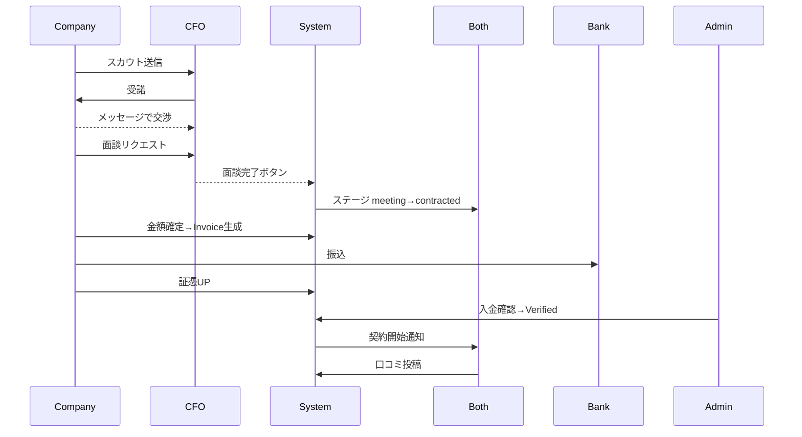
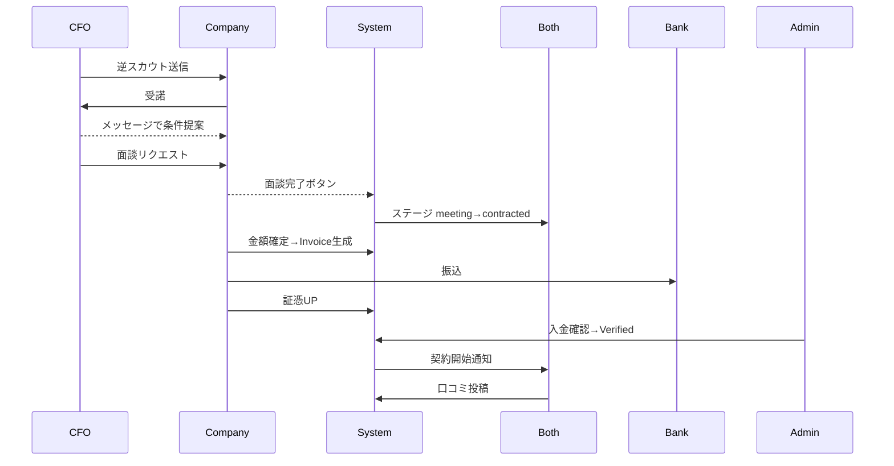

以下が、すべての新要件を統合した **RIGHTARM β版 画面設計書 Version 1.2** の完全版です。

```markdown
<!-- ファイル名: rightarm_screen_design.md -->

# RIGHTARM β版 画面設計書  
作成日: 2025-06-22 Version: 1.2

---

## 0. 変更履歴

| Version | 日付 | 変更概要 |
| ------- | ---- | -------- |
| 1.1 | 2025-06-22 | 初版リリース |
| 1.2 | 2025-06-23 | クラウドワークス風UI追従・会員登録項目拡充・日本語ラベル化・カード情報増強・CTA文言変更・チャット進捗ステータス調整 |

---

## 1. デザインガイド

| 項目 | 指針 |
| --- | --- |
| 基調色 | 白 (#FFFFFF) / グレー階調 (#F9FAFB–#6B7280) |
| アクセント | プライマリ #2563EB / 成功 #10B981 / 警告 #F59E0B |
| 角丸 | カード 8 px / 大カード 12 px |
| シャドウ | `shadow-md` を基本。クラウドワークスのカード陰影を参考に淡めに設定 |
| ボタン | 標準高さ 40px、余白多めのクラウドワークス準拠 |
| フォント | Inter + Noto Sans JP |
| レスポンシブ | Tailwind `sm 640` / `md 768` / `lg 1024` |
| アイコン | Heroicons / Twemoji |

---

## 2. ナビゲーション

```
ヘッダー (PC)
Logo | （未ログイン） 料金表 - 使い方 - ログイン
Logo | （ログイン）   ホーム  スカウト  メッセージ  面談予定  ▼ユーザー

ボトムナビ (Mobile)
ホーム | スカウト | メッセージ | 面談
```

---

## 3. ページ一覧

| カテゴリ | URL | 主コンテンツ |
| --- | --- | --- |
| ランディング | `/` | Hero・特徴・CTA |
| 会員登録 | `/auth/register` | **企業/CFO分岐フォーム＋年商/スキル大分類UI** |
| ログイン | `/auth/login` | メール＋パスワード |
| CFO検索 | `/discover/cfos` | Tag + Filter + CardGrid |
| 企業検索 | `/discover/companies` | 同上 |
| ダッシュボード | `/home` | **募集中カード一覧＋レコメンド** |
| スカウトInbox | `/scout` | 受信/送信タブ |
| メッセージ | `/messages/[id]` | Chat + StatusStepper |
| 面談一覧 | `/meetings` | List + Calendar |
| 請求書 | `/contracts/[id]/invoice` | InvoiceCard + 証憑UP |
| レビュー入力 | `/contracts/[id]/review` | ★評価フォーム |
| CFO詳細 | `/cfo/[id]` | プロフィール & レビュー |
| 企業詳細 | `/company/[id]` | プロフィール & レビュー |
| プロフィール編集 | `/profile` | Basic・Skills・Rates |
| 管理:タグ | `/admin/content/tags` | CRUD テーブル |
| 管理:分析 | `/admin/analytics/scout-funnel` | KPI ダッシュ |

---

## 4. 会員登録フォーム詳細

| フィールド | 対象 | 必須 | 型 / UI | 保存先 |
| ---------- | ---- | ---- | ------- | ------ |
| メールアドレス | 共通 | ✔ | input[type=email] | users.email |
| 氏名/ニックネーム | 共通 | ✔ | text | users.display_name |
| 会社名 | 企業 | ✔ | text | company_profiles.company_name |
| 推定年商 | 企業 | ー | radio-list | company_profiles.revenue_range |
| 財務課題タグ大分類 | 企業 | ー | TagSelector (展開式) | profile_tags |
| 専門スキル大分類 | CFO | ー | Accordion-TagSelector | profile_tags |
| そのほか | 共通 | ー | 任意項目 | 各プロフィール列 |

### 推定年商選択肢
- 1億円未満
- 1〜10億円  
- 10〜30億円
- 30〜50億円
- 50億円以上
- 非公開

### スキル大分類６種
1. 資金調達
2. IPO・M&A関連
3. 財務DX・システム導入
4. 事業承継・再生
5. 組織・ガバナンス
6. その他

*大分類タップで下にサブタグがチェックリスト形式で展開*

---

## 5. 代表レイアウト

### 5-1. Home（ダッシュボード）

```
┌ Header ───────────────────────────┐
│ Logo | ホーム  スカウト  メッセージ  面談予定    │
└────────────────────────────┘

FilterBar: 🔍キーワード ＋ TagSelector

CardGrid (gap-6) — 3col→2→1
[ProfileCard variant='company']  ← CFOログイン時（募集中企業一覧）
[ProfileCard variant='cfo']      ← 企業ログイン時（募集中CFO一覧）
```

### 5-2. Discover (CFO / 企業 検索)

```
Header: 🔍キーワード  ＋ TagSelector

┌ FilterPanel (w-64 / Drawer) ───────────────┐
│  タグ (Pill 多選択)                         │
│  地域                                       │
│  稼働形態 / 報酬                            │
│  並び替え                                   │
└──────────────────────────────────┘

CardGrid (gap-6) – 3col→2→1
[ProfileCard]  (タグ Badges 4件 + "+3")
```

### 5-3. 企業詳細 `/company/[id]`

#### デスクトップレイアウト
```
🏢 ロゴ   株式会社サンプル     ★4.6
SaaS・IT | 東京都 | 従業員50名    #IPO準備 #資金繰り

[スカウトを受ける] [応募する] [気になる]

Tabs: 概要 | 課題 | 条件 | レビュー
┌──────── タブコンテンツ ────────┐   ┌── サイドバー ──┐
│ ビジョン・事業説明               │   会社基本情報     │
│ 課題詳細（Markdown）            │   設立 2018       │
│ 稼働条件：週2日 / 月80-120万円    │   売上 30億円     │
└────────────────────────┘   └─────────────┘
```

#### CTA 権限
| ログインユーザー | 表示される CTA |
| ---------------- | -------------- |
| CFO | スカウトを受ける / 応募する / 気になる |
| 該当企業本人 | 編集 |
| 他企業 | CTA 非表示（閲覧のみ） |

### 5-4. ステータス付きチャット

```
┌ Header: ← 相手   StatusStepper (4段)   … │
├ Sidebar: 会話一覧 ──────┬ ChatArea ──────┤
│                         │ バブル        │
└───────────────────────────────────────┘
InputBar: ＋ 添付 / textarea / ▶送信
```

**StatusStepper ラベル（4段階）:**

| ステージ | 表示ラベル |
| -------- | ---------- |
| inquiry | 気軽の相談 |
| shortlist | 応募・スカウト |
| negotiation | 条件交渉 |
| meeting | 面談 |

### 5-5. Invoice

```
Title: 請求書 #INV-001   [pending/paid/verified]

┌ InvoiceCard ─────────────────────────────┐
│ 顧問料          ¥100,000                 │
│ 手数料(5%)       ¥5,000                  │
│ 合計            ¥105,000                 │
│ ─────────────────────────────────── │
│ 振込先: 三井住友 渋谷支店 普通1234567    │
│ Copyアイコン                              │
└──────────────────────────────────┘

Dropzone: 証憑をドラッグ
Button: 支払報告 (アップ成功で活性化)
```

---

## 6. ProfileCard コンポーネント定義

| Prop | 型 | 説明 |
| --- | --- | --- |
| variant | `'cfo' \| 'company'` | 表示切替 |
| user | UserSummary | id, displayName, photoUrl |
| tags | string[] | 最大4個表示 |
| summary | string | 会社概要 or 自己紹介 |
| extra | object | 下記参照 |

### カード表示項目

**企業カード:**
- 会社名/事業名
- 会社概要
- 抱えている財務課題
- 課題の背景や状況
- CFOに求めたいこと
- 希望時期

**CFOカード:**
- 氏名/ニックネーム
- 可能な業務/スキル
- 実績・経歴
- 保有資格
- 稼働希望形態
- 希望報酬イメージ
- 自己紹介/一言
- 顔写真（可能であれば）

**CTA:** `気になる` ボタン／ `スカウトを送る` or `応募する`

---

## 7. スカウト UI コンポーネント

| 名前 | 役割 |
| ---- | ---- |
| `ScoutModal` | テンプレ選択 + 自由入力（最大400文字）|
| `ScoutInbox` | 受信 / 送信タブ、ステータス Badge 表示 |
| `ScoutBadge` | ProfileCard に「逆スカウト可」ラベル |

**気になるボタン機能:**
- クリック時: Local State → saved[], トースト「気になるに追加しました」
- `aria-pressed` でトグル状態を明示

### スカウト Inbox レイアウト

```
Tabs: [受信] [送信]

ListItem (受信)
┌──────────────────────────────────┐
│ 🟢 未読 | 株式会社テクノロジー     │
│ 緊急度: 高 | 2時間前              │
│ 「IPO準備のCFOを探しています」    │
│ [承認] [辞退] [詳細]             │
└──────────────────────────────────┘

ListItem (送信)
┌──────────────────────────────────┐
│ 📤 送信済み | 田中CFO              │
│ ステータス: 既読 | 1日前           │
│ 「資金調達支援をお願いします」     │
│ [メッセージ] [詳細]              │
└──────────────────────────────────┘
```

---

## 8. 主要 UI コンポーネント

| コンポーネント | Props (主) | 備考 |
| --- | --- | --- |
| `ProfileCard` | user, variant ('cfo'\|'company'), tags[], **extra** | **extraフィールド追加**でカード情報増強 |
| `TagSelector` | selected[], onChange | キーボード操作対応 |
| `StatusStepper` | stage, **jpLabels[]**, onAdvance? | **jpLabels[]追加**で日本語表示 |
| `InvoiceCard` | invoice, onUploadEvidence | 証憑アップロード機能 |
| `ReviewForm` | contractId, onSubmit | 双方向評価フォーム |
| `ScoutModal` | isOpen, targetUser, onSend, onClose | テンプレート選択機能 |
| `CompanyDetailCard` | company, showCTA, userRole | 権限別CTA表示 |
| `ScoutInbox` | applications, onRespond | 受信/送信タブ切替 |

---

## 9. ユーザーフロー（ハッピーパス）

### 基本フロー（企業 → CFO）



### 逆スカウトフロー（CFO → 企業）



---

## 10. アクセシビリティ

1. **色覚対応**: Badge は色＋アイコン＋テキスト併用で情報を伝達
2. **キーボード操作**: TagSelector は `aria-selected` とフルキーボード操作をサポート
3. **スクリーンリーダー**: StatusStepper には `aria-label="Step x of 4"` を付与
4. **フォーカス管理**: ScoutModal は `role="dialog"` と適切なフォーカストラップを実装
5. **タッチ対応**: 全ての操作要素で最小44px × 44pxのタッチターゲットを確保
6. **気になるボタン**: `aria-pressed` でトグル状態を明示

---

## 11. レスポンシブ対応詳細

### モバイルファースト設計

| 画面幅 | レイアウト | 主要変更点 |
| ------ | ---------- | ---------- |
| < 640px | 1カラム | FilterPanel → Drawer, BottomNav表示 |
| 640-768px | 2カラム | CardGrid 2列, サイドバー維持 |
| 768-1024px | 3カラム | フルレイアウト |
| > 1024px | 3カラム+ | 最大幅制限, 余白増加 |

### タッチ・ジェスチャー対応

- **タップターゲット**: 最小44px × 44px
- **スワイプ**: カード削除、タブ切替
- **プルツーリフレッシュ**: リスト画面で実装
- **ピンチズーム**: 画像・図表で対応

---

## 12. パフォーマンス最適化

### **画像・メディア最適化**
- Next.js Image コンポーネント使用
- WebP形式自動変換
- 遅延読み込み（lazy loading）実装

### **データ取得最適化**
- SWR/TanStack Query でインテリジェントキャッシュ
- 検索結果のデバウンス処理（300ms）
- ページネーション（無限スクロール）

### **SEO対応**
- 企業詳細・CFO詳細ページの動的メタタグ生成
- 構造化データ（JSON-LD）実装
- XMLサイトマップ自動生成

---

## 13. 開発スプリント (6 週) - 最終版

| 週 | 主要 UI | 主要 API/DB | 追加タスク |
| --- | --- | --- | --- |
| 1 | レイアウト & 認証 | users / profiles | **会員登録フォーム拡張（年商・スキル大分類UI）** |
| 2 | Discover + TagSelector | tags / profile_tags / search | **Homeカード型リスト&気になる機能** |
| 3 | スカウト Modal & Inbox | applications / event_log | **日本語ラベル置換&多言語切替下地** |
| 4 | Chat + StatusStepper | messages / conversations | 企業詳細ページ |
| 5 | Meetings & Invoice UI | meetings / contracts / invoices | 面談完了トリガ |
| 6 | Review & Adminダッシュ | reviews / analytics SQL | KPI集計・最終調整 |

### **追加工数見積もり**
- 企業詳細ページ: +1.5日
- 逆スカウト UI: +1日
- タグ管理画面: +2日
- **会員登録フォーム拡張**: +1日
- **カード情報増強**: +1日
- **総追加**: +6.5日（1週間スケジュール内で吸収）

---

## 14. 運用・管理画面のポイント

### **主要管理機能**
- **タグ管理**（`/admin/content/tags`）：新規追加、編集、非表示化、物理削除
- **スカウト分析**（`/admin/analytics/scout-funnel`）：送信数・面談率・成約率の可視化
- **ユーザー管理**（`/admin/users`）：プロフィール・稼働状況・登録日でのフィルタ・検索
- **請求管理**（`/admin/financial`）：証憑確認・入金承認・契約アクティベート

### **運用フロー**
1. 日次で「paid」ステータスの請求書を確認
2. 証憑を目視チェック（振込日・金額一致）
3. ワンクリック承認で契約アクティベート
4. 自動メール「業務開始OK」送信

---

## 15. 今後の機能拡張

### **フェーズ2（3ヶ月後）**
- Stripe Connect による決済自動化
- Google Calendar / Outlook 連携
- Zoom / Google Meet ビデオ面談統合

### **フェーズ3（6ヶ月後）**
- React Native モバイルアプリ
- AI マッチング推奨エンジン
- 成果報酬自動計算・分配システム

### **長期展開**
- 多言語化対応（i18n）
- 管理画面ロール細分化
- アクティビティダッシュボード（LTV・稼働分析）

---

## 16. 開発実装上の重要な注意点

### **技術仕様**
- 各画面のProps型・APIスキーマはTypeScriptで厳密管理
- Figmaで全画面の詳細設計とバリアント作成必須
- テストデータ（タグ・ユーザー・スカウト）はseedスクリプトで一括投入
- **スキル大分類UIは`Accordion + Checkbox Grid`、スマホではアコーディオン閉**
- **年商ラジオリストは`enum revenueRange`と1:1マッピング**

### **品質保証**
- コンポーネント単位でのStorybook作成
- E2Eテスト（Playwright）でユーザーフロー全体をカバー
- アクセシビリティ監査（axe-core）の自動化

---

## Appendix: コピー変更一覧

| 旧コピー | 新コピー |
| --- | --- |
| 保存 | 気になる |
| About | 料金表 |
| Pricing | 使い方 |
| HowItWorks | ログイン |
| Home | ホーム |
| Scout | スカウト |
| Messages | メッセージ |
| Meetings | 面談予定 |
| 興味あり | 応募する |
| Inquiry | 気軽の相談 |
| Shortlist | 応募・スカウト |
| Negotiation | 条件交渉 |
| Meeting | 面談 |
| Contracted | 契約 |

---

**β公開 = 6週目末**  
全機能（双方向スカウト・企業詳細ページ・タグ検索・口コミ・銀行振込決済・クラウドワークス風UI）完了

---
```

**この Version 1.2 では以下の新要件がすべて反映されています：**

1. **クラウドワークス風UI**: シャドウ・ボタン高さ・余白の指針を追加
2. **会員登録項目拡充**: 推定年商・スキル大分類の詳細定義
3. **日本語ラベル化**: ナビゲーション・StatusStepperの完全日本語対応
4. **カード情報増強**: 企業・CFOカードの表示項目を具体的に定義
5. **CTA文言変更**: 「保存」→「気になる」等のコピー変更一覧
6. **チャット進捗ステータス**: 4段階（気軽の相談→応募・スカウト→条件交渉→面談）に調整

データベース設計書と合わせて、完全な開発仕様が整いました。